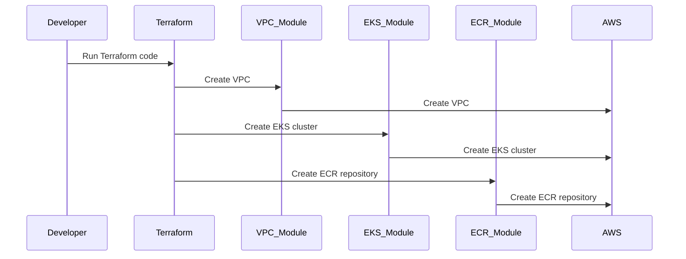

# Architecture

## Overview

The architecture of the project is based on the following diagram:

In this sequence diagram, there are six participants:

- **Developer**: The person who is running the Terraform code.

- **Terraform**: The tool that is used to create the infrastructure.

- **VPC_Module**: The Terraform module that is used to create the VPC.

- **EKS_Module**: The Terraform module that is used to create the EKS cluster.

- **ECR_Module**: The Terraform module that is used to create the ECR repository.

- **AWS**: The cloud provider that the infrastructure is being created on.

The sequence diagram shows the flow of messages between the participants. The Developer runs the Terraform code, which creates the VPC, EKS cluster, and ECR repository on AWS. The Terraform tool sends messages to the appropriate modules (VPC_Module, EKS_Module, and ECR_Module) to create the infrastructure, and the modules send messages to AWS to create the resources.
